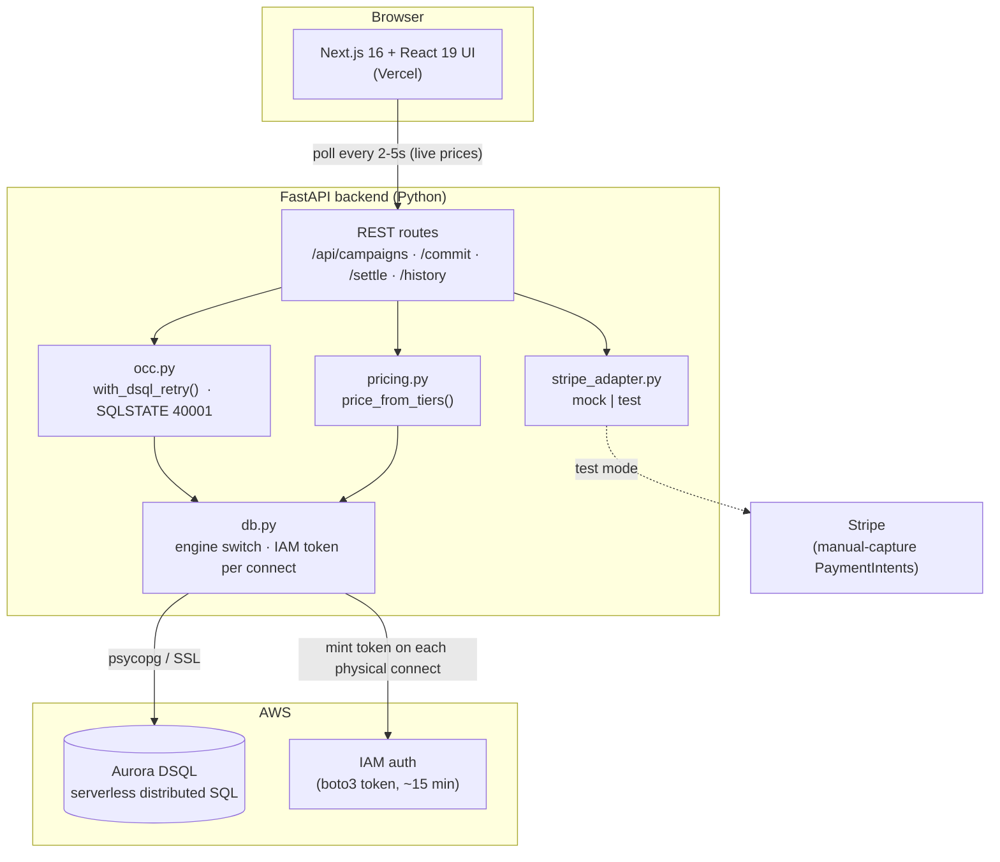
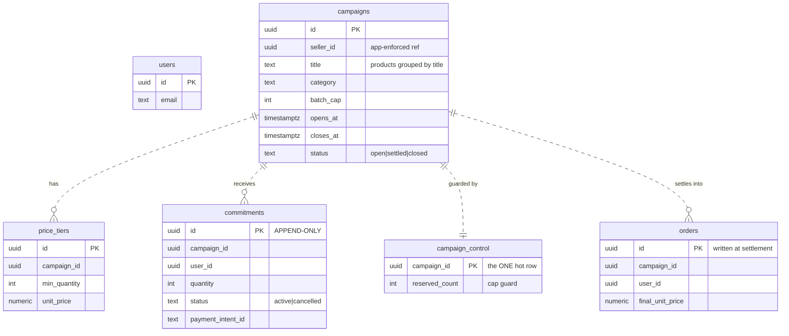
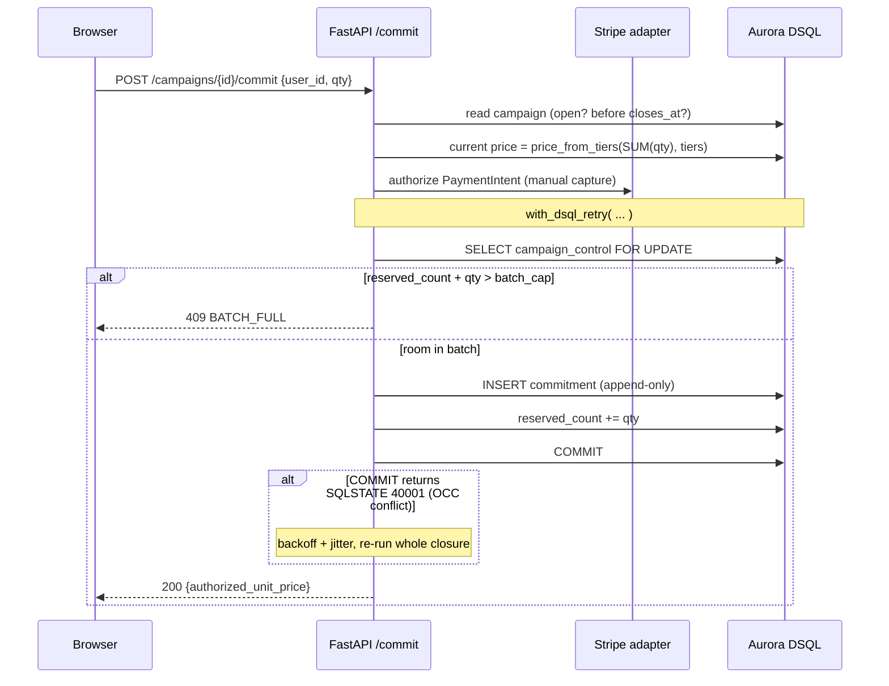
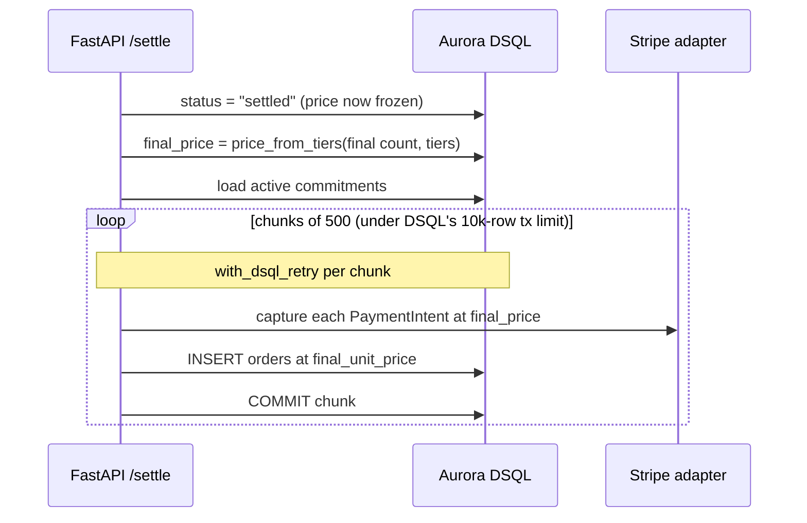

# Pindrop — Architecture

Pindrop is a **drop-pricing group-buy marketplace**: the unit price falls as more people
commit, and *every* committed buyer pays the lowest tier reached by the deadline. Sharing
a drop recruits more buyers, which drops the price for everyone already in.

The interesting engineering problem is doing this correctly on **Aurora DSQL** — a
serverless distributed SQL database with optimistic concurrency (no row locks), no foreign
keys, and a one-DDL-per-transaction rule — without overselling a batch or creating a hot
write row that serializes every commit.

---

## System overview

**Frontend** (Next.js 16 / React 19 / Tailwind v4, deployed on Vercel) is a thin client
that polls the backend for live prices and renders the drop mechanic. No business logic
lives here.

**Backend** (FastAPI, standalone Python) owns all pricing, concurrency, and settlement.
It is driver-switchable: `DB_DRIVER=local` runs against SQLite/Postgres for dev,
`DB_DRIVER=dsql` runs against the real cluster. Stripe is behind an adapter
(`STRIPE_MODE=mock|test`) so the full flow runs with no key.

**Aurora DSQL** is the system of record. Connections authenticate with a short-lived IAM
token minted locally by boto3 on every physical connect (tokens expire ~15 min, so we
never cache them).

---

## Data model (no foreign keys — DSQL doesn't support them)

Relationships are enforced in application code, not by DDL (DSQL has no FK constraints).
All primary keys are random UUIDs (`gen_random_uuid()`) to avoid hot key ranges.

### The two key design choices

1. **`commitments` is append-only.** Each commit is its own INSERT with a random UUID
   key. The live count is a conflict-free `SUM(quantity)` aggregate over a consistent
   snapshot — reads never conflict, so the price display scales without contention.

2. **`campaign_control` is the *only* hot row.** It exists purely for the batch-cap
   guard. Under DSQL's OCC, `SELECT ... FOR UPDATE` on this row doesn't block — it surfaces
   the conflict at commit time, so the losing transaction retries. This prevents
   overselling the last unit without serializing every read.

---

## Commit flow (the cap-guarded write path)

Every write transaction is wrapped in `with_dsql_retry()`: on a `40001` serialization
failure it re-runs the *entire* unit of work with exponential backoff + jitter (up to 5
attempts). Reads are outside the retry path because they can't conflict.

---

## Settlement flow (locking the final price)

Once settled, the commitment count is frozen, so `price_from_tiers` returns the locked
final price for every buyer. Settlement is chunked at 500 rows per transaction to stay
well under DSQL's 10,000-row transaction limit; each chunk is independently OCC-retried.

---

## DSQL-specific accommodations (what the cluster forced us to change)

| DSQL constraint | How Pindrop handles it |
|---|---|
| **No foreign keys** | Refs enforced in app code; no `references()` / FK DDL. |
| **No `SAVEPOINT`** | psycopg's first-connect hstore probe uses SAVEPOINT → set `use_native_hstore=False` on the DSQL engine to skip it. |
| **One DDL statement per transaction** | `init_db()` creates each table in its own AUTOCOMMIT transaction (can't batch `create_all`). |
| **Optimistic concurrency (SQLSTATE 40001)** | `with_dsql_retry()` re-runs the whole transaction with exponential backoff + jitter. |
| **10,000-row transaction limit** | Settlement chunks buyers into batches of 500. |
| **IAM token auth (~15 min TTL)** | boto3 mints a fresh token on every physical connect (`do_connect` event); never cached. |
| **Every query is a network hop** | Hot endpoints batch reads into set-based queries (no N+1) and compute pricing in Python. |

---

## Tech stack

- **Frontend:** Next.js 16, React 19, Tailwind v4, deployed on **Vercel**
- **Backend:** FastAPI + SQLAlchemy 2.0 + psycopg 3 (Python 3.12)
- **Database:** **Amazon Aurora DSQL** (IAM auth via boto3)
- **Payments:** Stripe (manual-capture PaymentIntents), env-toggled mock/test adapter
- **Concurrency:** append-only commitments + single OCC-guarded control row per campaign
