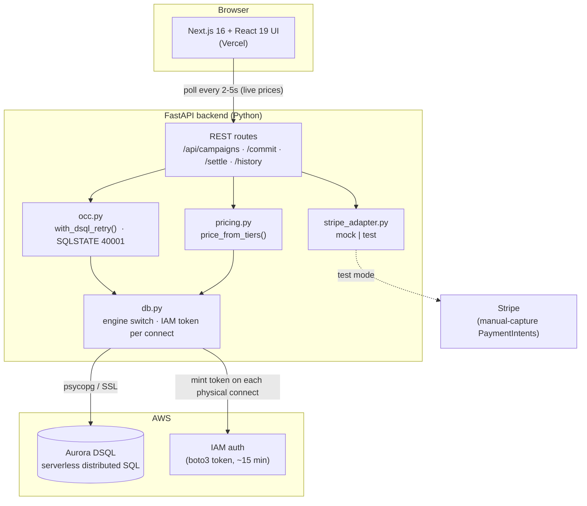

# Pindrop

**The price drops as more people join.** Pindrop is a drop-pricing group-buy marketplace:
the unit price falls as more buyers commit, and *every* committed buyer pays the lowest
tier reached by the deadline. Sharing a drop recruits more buyers — which drops the price
for everyone already in.

Built for the AWS Databases × Vercel hackathon on **Amazon Aurora DSQL**.

| | |
|---|---|
| **Frontend** | Next.js 16, React 19, Tailwind v4 — deployed on **Vercel** |
| **Backend** | FastAPI + SQLAlchemy 2.0 + psycopg 3 (Python 3.12) |
| **Database** | **Amazon Aurora DSQL** (serverless distributed SQL, IAM auth) |
| **Payments** | Stripe (manual-capture PaymentIntents), env-toggled mock/test |



> Full data model + commit/settle sequence diagrams: **[ARCHITECTURE.md](ARCHITECTURE.md)**.

---

## How the drop mechanic works

Each campaign (a "drop") has a ladder of **price tiers** keyed to a committed-quantity
threshold — e.g. `$329 at 1`, `$299 at 10`, `$269 at 30`. The live price is the lowest
tier unlocked by the current commitment count. When the drop closes, it **settles**: the
final (lowest reached) price is locked, and every buyer is charged that price.

The hard part is doing this correctly on Aurora DSQL — optimistic concurrency, no row
locks, no foreign keys — without overselling a batch. The design:

- **`commitments` is append-only** — each commit is its own INSERT; the live count is a
  conflict-free `SUM(quantity)` aggregate, so reads never contend.
- **One hot row per campaign (`campaign_control`)** guards the batch cap via
  `SELECT ... FOR UPDATE`. Under DSQL's OCC this surfaces conflicts at commit time
  (SQLSTATE `40001`); the losing transaction retries with backoff + jitter.

Full design, data model, and sequence diagrams: **[ARCHITECTURE.md](ARCHITECTURE.md)**.

---

## Repository layout

```
.
├── backend/            FastAPI app (the system of record)
│   ├── app/
│   │   ├── main.py         REST routes
│   │   ├── models.py       SQLAlchemy models (UUID PKs, no FKs — DSQL-safe)
│   │   ├── db.py           local|dsql engine switch; IAM token per connect
│   │   ├── occ.py          with_dsql_retry() — SQLSTATE 40001 retry wrapper
│   │   ├── pricing.py      tier-walk pricing
│   │   └── stripe_adapter.py   mock | test
│   ├── scripts/        create_tables.py, seed.py
│   └── tests/          pytest (in-memory SQLite)
├── frontend/           Next.js app (Vercel)
│   ├── app/                pages: home, /campaigns/[id], /campaigns/new, /commitments
│   ├── components/         PriceDropDisplay, cart, CampaignBrowser, ...
│   └── lib/                typed API client
├── ARCHITECTURE.md     diagrams + design rationale
└── diagrams/           rendered architecture PNGs
```

---

## Run it locally

The backend runs against **SQLite** by default — no cloud needed to develop.

### 1. Backend

```sh
cd backend
python3.12 -m venv venv
source venv/bin/activate
pip install -r requirements.txt

cp .env.example .env          # defaults to DB_DRIVER=local, STRIPE_MODE=mock
python -m scripts.seed        # create + seed the local dev.db
python -m uvicorn app.main:app --reload
```

API is now on `http://127.0.0.1:8000` (docs at `/docs`).

### 2. Frontend

```sh
cd frontend
npm install
cp .env.local.example .env.local   # NEXT_PUBLIC_API_BASE=http://127.0.0.1:8000
npm run dev
```

App is on `http://localhost:3000`.

---

## Configuration

Backend (`backend/.env`):

| Var | Values | Notes |
|---|---|---|
| `DB_DRIVER` | `local` \| `dsql` | `local` = SQLite/Postgres; `dsql` = Aurora DSQL |
| `DATABASE_URL` | connection string | used when `DB_DRIVER=local` |
| `DSQL_CLUSTER_ENDPOINT` | `…dsql.us-east-1.on.aws` | used when `DB_DRIVER=dsql` |
| `DSQL_USER` / `DSQL_DATABASE` | `admin` / `postgres` | defaults match DSQL |
| `AWS_REGION` | e.g. `us-east-1` | must match the cluster |
| `STRIPE_MODE` | `mock` \| `test` | `mock` runs the full flow with no key |

For DSQL the password is an **IAM token minted at runtime** by boto3 — never set one in
`.env`. The backend uses the AWS credentials in the environment (or an EC2 instance role).

Frontend (`frontend/.env.local`):

| Var | Notes |
|---|---|
| `NEXT_PUBLIC_API_BASE` | URL of the backend (defaults to `http://127.0.0.1:8000`) |

---

## Run on Aurora DSQL

Once you've provisioned a cluster and your AWS credentials can mint a token
(`dsql:DbConnectAdmin`), point the backend at it:

```sh
cd backend && source venv/bin/activate
# in .env: DB_DRIVER=dsql, DSQL_CLUSTER_ENDPOINT=<your-cluster>, AWS_REGION=us-east-1
python -m scripts.create_tables   # one DDL per transaction (DSQL requirement)
python -m scripts.seed            # idempotent: wipes + reseeds
python -m uvicorn app.main:app --reload
```

The DB layer already handles DSQL's quirks: no `SAVEPOINT` (native-hstore probe disabled),
one DDL statement per transaction, SQLSTATE `40001` retries, and a fresh IAM token per
physical connect.

---

## Tests

```sh
cd backend && source venv/bin/activate && pytest
```

Tests run against in-memory SQLite — no cloud or network required.

---

## Deployment

- **Frontend → Vercel.** Set `NEXT_PUBLIC_API_BASE` to the public backend URL.
- **Backend → AWS** (EC2), kept as a persistent process so the DSQL connection pool, IAM
  token reuse, and chunked settlement all work unchanged. DSQL is reached **outbound over
  the internet** with IAM auth — it is not a VPC resource.
